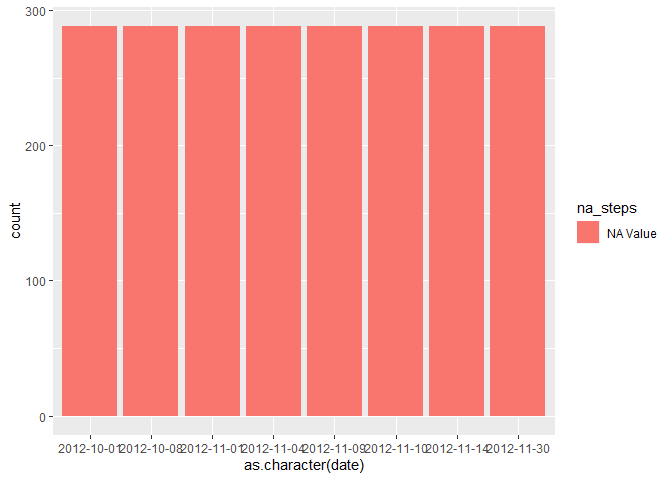
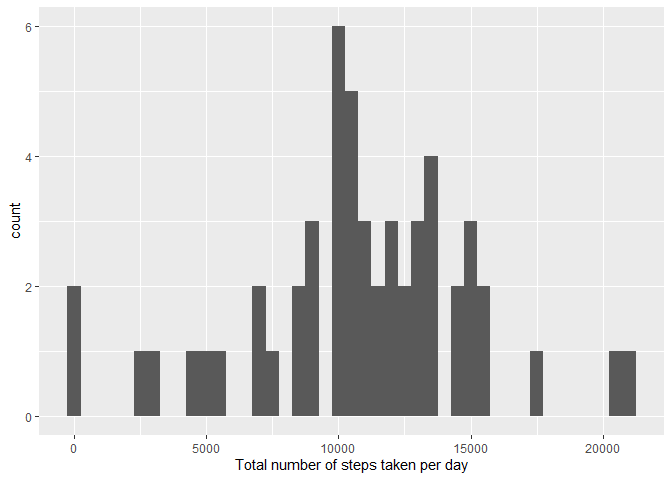
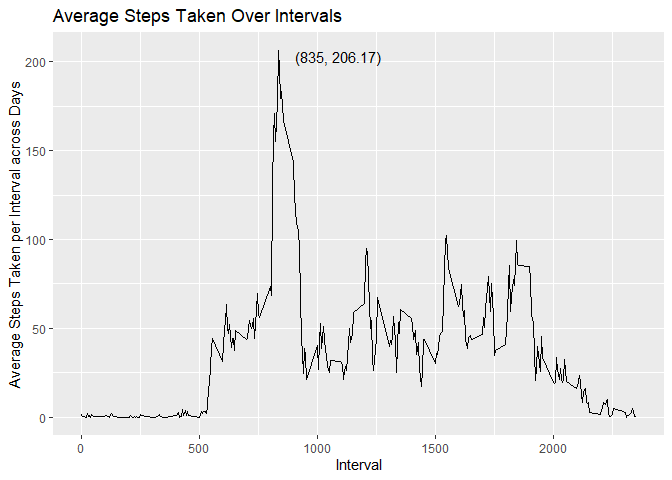
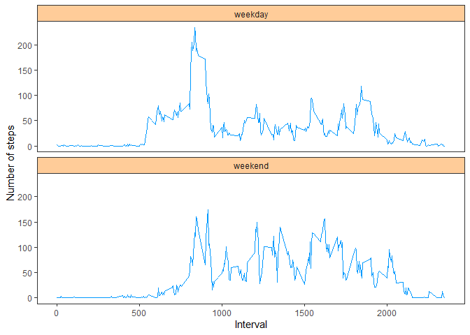

```r
knitr::opts_chunk$set(
  echo = TRUE,       
  warning = FALSE,   
  message = FALSE    
)
```

##1. Loading and preprocessing the data

The following chunk loads data, examines data, cleanup data, combining "date" and "interval" columns into a new column "time".


```r
# load libraries
library(tidyverse)

# unzip the file if it does not exist
if (!file.exists("activity.csv")) {
  # Unzip the file
  unzip("activity.zip", exdir = "./")
}  

# load the data
activity <- read_csv("activity.csv")

# examining the data
str(activity)
```

```
## spc_tbl_ [17,568 × 3] (S3: spec_tbl_df/tbl_df/tbl/data.frame)
##  $ steps   : num [1:17568] NA NA NA NA NA NA NA NA NA NA ...
##  $ date    : Date[1:17568], format: "2012-10-01" "2012-10-01" ...
##  $ interval: num [1:17568] 0 5 10 15 20 25 30 35 40 45 ...
##  - attr(*, "spec")=
##   .. cols(
##   ..   steps = col_double(),
##   ..   date = col_date(format = ""),
##   ..   interval = col_double()
##   .. )
##  - attr(*, "problems")=<externalptr>
```

```r
# inspect NAs
summary(activity)
```

```
##      steps             date               interval     
##  Min.   :  0.00   Min.   :2012-10-01   Min.   :   0.0  
##  1st Qu.:  0.00   1st Qu.:2012-10-16   1st Qu.: 588.8  
##  Median :  0.00   Median :2012-10-31   Median :1177.5  
##  Mean   : 37.38   Mean   :2012-10-31   Mean   :1177.5  
##  3rd Qu.: 12.00   3rd Qu.:2012-11-15   3rd Qu.:1766.2  
##  Max.   :806.00   Max.   :2012-11-30   Max.   :2355.0  
##  NA's   :2304
```

```r
# cleanup activity data, combining date and time into a new time column
activity <- activity %>% 
  mutate(new_date = as.character(date),
         new_interval = str_pad(as.character(interval),
                                width = 4, side = "left", pad = "0"),
         hour = str_sub(new_interval, start = 1L, end = 2L),
         min = str_sub(new_interval, start = 3L, end = 4L),
         time = paste(new_date, 
                      paste(hour, min, sep = ":"),
                      sep = " "),
         time = ymd_hm(time)) %>% 
  select(steps, date, interval, time) %>% 
  mutate(Days = weekdays(date))
```

##2. Imputing missing values

The is step is moved up after loading the pre-processing data, as this is the logical the next step after NAs are observed.

The following discoveries are made about NAs. 1. NAs only exist in the steps column, as shown by the code below that all incomplete cases have NAs in the column "steps".


```r
# locate NAs, NAs only exist in steps column
sum(!complete.cases(activity))
```

```
## [1] 2304
```

```r
sum(is.na(activity$steps))
```

```
## [1] 2304
```

```r
sum(is.na(activity$date))
```

```
## [1] 0
```

```r
sum(is.na(activity$interval))      
```

```
## [1] 0
```

2.  For days in that NA occurs, all data logged for that day are NAs. As shown by the code below from the tibble "NA_entry", which contains all NA entries, and the graph. Therefore, a tibble "activity_NA_removed" is generated with all NAs removed, and is subsequently applied in the following analysis.


```r
#find out the distribution of NAs
NA_entry <- activity %>% 
  #find out all dates that contain NA values
  filter(date %in% unique(activity$date[!complete.cases(activity)])) %>%
  # use 0.5 to replace NA to distinguish it from other values
  mutate(na_steps = case_when(is.na(steps) ~ "NA Value", 
                              .default = "Real Value")) 

NA_entry %>% 
  ggplot(aes(x = as.character(date), fill = na_steps)) +
  geom_bar()
```

<!-- -->

```r
str(NA_entry)
```

```
## tibble [2,304 × 6] (S3: tbl_df/tbl/data.frame)
##  $ steps   : num [1:2304] NA NA NA NA NA NA NA NA NA NA ...
##  $ date    : Date[1:2304], format: "2012-10-01" "2012-10-01" ...
##  $ interval: num [1:2304] 0 5 10 15 20 25 30 35 40 45 ...
##  $ time    : POSIXct[1:2304], format: "2012-10-01 00:00:00" "2012-10-01 00:05:00" ...
##  $ Days    : chr [1:2304] "Monday" "Monday" "Monday" "Monday" ...
##  $ na_steps: chr [1:2304] "NA Value" "NA Value" "NA Value" "NA Value" ...
```

```r
#The totol amount of NA value is equal to the amount of all values one the day when NA appeards.
NA_entry %>% nrow() == sum(is.na(NA_entry$steps))
```

```
## [1] TRUE
```

```r
# The following code removes NA value from activity
activity_NA_removed <- activity %>% 
  filter(complete.cases(.))
```

##3. What is mean total number of steps taken per day?

The total number of steps take per day is captured in the tibble "daily_activity_NA_removed".

It can be seen from the histogram below that the major steps taken in one day is around 10000.


```r
# Calculate the total number of steps taken per day
daily_activity_NA_removed <- activity_NA_removed %>% 
  group_by(date) %>% 
  summarise(step_per_day = sum(steps, na.rm = T))

# Make a histogram of the total number of steps taken each day
daily_activity_NA_removed %>% 
  ggplot(aes(x = step_per_day)) +
  geom_histogram(binwidth = 500) +
  labs(x = "Total number of steps taken per day")
```

<!-- -->

The mean and median of the total number of steps taken per day are 10766 and 10765 respectively.


```r
# Calculate and report the mean and median of the total number of steps taken per day
daily_activity_NA_removed %>% 
  summarise(`mean step per day` = mean(step_per_day),
            `median step per day` = median(step_per_day))
```

```
## # A tibble: 1 × 2
##   `mean step per day` `median step per day`
##                 <dbl>                 <dbl>
## 1              10766.                 10765
```

##4. What is the average daily activity pattern?

The plot below is the time series plot of the 5-minute interval (x-axis) and the average number of steps taken, averaged across all days (y-axis).

The plot and the peak labelled on the plot show that the maxium step in a 5 min interval is around 206 steps, which occurs around 8:35 in the morning.


```r
# Make a time series plot (i.e. type = "l") of the 5-minute interval (x-axis) and the average number of steps taken, averaged across all days (y-axis)
activity_NA_removed %>% 
  group_by(interval) %>% 
  summarise(average_steps_taken = mean(steps)) %>% 
  ungroup() %>% 
  ggplot(aes(x = interval, y = average_steps_taken)) +
  geom_line()  +
  geom_text(data = . %>% filter(average_steps_taken == max(average_steps_taken)),
            aes(label = sprintf("(%d, %0.2f)", interval, max(average_steps_taken))),
            hjust = -0.2, vjust = 1) +
  labs(title = "Average Steps Taken Over Intervals",
       x = "Interval",
       y = "Average Steps Taken per Interval across Days")
```

<!-- -->

##5. Are there differences in activity patterns between weekdays and weekends?

As shown by the graph below, the user takes more steps in the morning of weekdays, and less steps for the rest of the day during weekdays.


```r
#Create a new factor variable in the dataset with two levels – “weekday” and “weekend” indicating whether a given date is a weekday or weekend day.
weekdays_or_weekend <- activity_NA_removed %>% 
  mutate(weekdays_or_weekend = as.factor(case_when(
    Days %in% c("Monday",   "Tuesday",   "Wednesday", "Thursday",  "Friday") ~ "weekday", 
    .default = "weekend"))) %>% 
  group_by(interval, weekdays_or_weekend) %>% 
  summarise(average_steps_taken = mean(steps)) %>% 
  ungroup() 

#Make a panel plot containing a time series plot (i.e. 
# type = "l") of the 5-minute interval (x-axis) and the average number of steps taken, averaged across all weekday days or weekend days (y-axis). See the README file in the GitHub repository to see an example of what this plot should look like using simulated data.

weekdays_or_weekend %>% 
  ggplot(aes(x = interval, y = average_steps_taken)) +
  geom_line(color = "#0099FF") +
  facet_wrap(facets = vars(weekdays_or_weekend), nrow = 2) +
  theme_bw() +
  theme(
    panel.grid.major = element_blank(),  
    panel.grid.minor = element_blank(),  
    strip.background = element_rect(fill = "#FFCC99")  
    ) +
  labs(x = "Interval",
       y = "Number of steps")
```

<!-- -->
